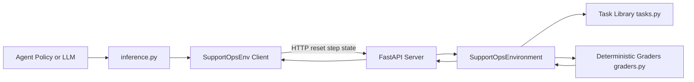
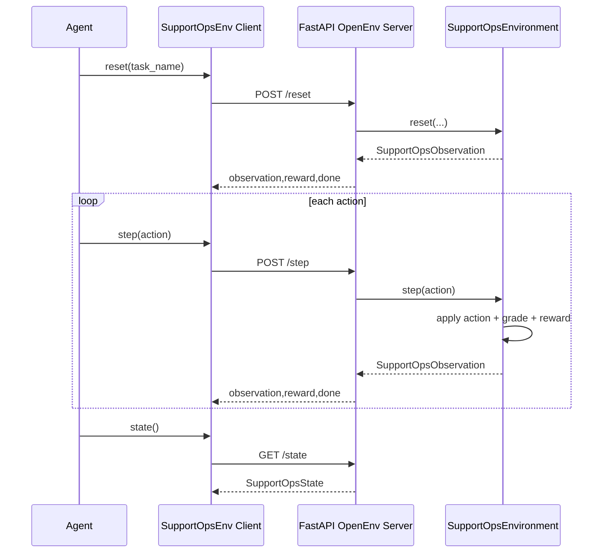

<!-- markdownlint-disable MD025 -->

# Proj_Scale OpenEnv

`Proj_Scale` is a real-world OpenEnv environment for customer support operations. The agent must triage tickets, route to the correct team, choose escalation vs resolution, and send useful customer responses under SLA pressure.

This is intentionally not a game environment. It models common support workflows in SaaS operations.

## 1) Real-World Objective

The environment simulates these operational constraints:

- SLA urgency by customer tier and time targets.
- Correct queue routing (tier1, billing, sre, security, product).
- Multi-ticket prioritization in mixed workloads.
- Communication quality with deterministic keyword and length checks.

## 2) High-Level Architecture



## 3) Project File Structure

```text
.
├── __init__.py
├── client.py
├── docs/
│   └── guide.md
├── Dockerfile
├── graders.py
├── inference.py
├── models.py
├── openenv.yaml
├── preval_script.sh
├── pyproject.toml
├── README.md
├── tasks.py
├── tests/
│   ├── conftest.py
│   ├── test_api.py
│   ├── test_environment.py
│   └── test_graders.py
└── server
    ├── __init__.py
    ├── app.py
    ├── requirements.txt
    └── support_ops_environment.py
```

## 4) OpenEnv Interface Compliance

Implemented components:

- `openenv.yaml` present at repo root.
- Typed Pydantic models for action, observation, reward, and state in `models.py`.
- Standard API endpoints exposed by OpenEnv server app (`server/app.py`).
- Environment implementation provides `reset()`, `step(action)`, and `state` via `SupportOpsEnvironment`.

Validation command:

```bash
.venv/bin/openenv validate
```

Expected result:

```text
[OK] Proj_Scale: Ready for multi-mode deployment
```

## 5) Action Space

Action model: `SupportOpsAction`

| Field       | Type           | Notes                                                                          |
| ----------- | -------------- | ------------------------------------------------------------------------------ |
| `command`   | enum           | `set_priority`, `set_category`, `assign_team`, `set_status`, `reply`, `submit` |
| `ticket_id` | string or null | Required for all commands except `submit`                                      |
| `value`     | string or null | Used by classification/routing/status commands                                 |
| `message`   | string or null | Used by `reply`                                                                |

Command semantics:

- `set_priority`: one of `low`, `medium`, `high`, `critical`
- `set_category`: one of `access`, `billing`, `outage`, `security`, `feature_request`
- `assign_team`: one of `tier1`, `billing`, `sre`, `security`, `product`
- `set_status`: one of `new`, `in_progress`, `resolved`, `escalated`
- `reply`: requires at least 20 chars
- `submit`: finalize episode for grading

## 6) Observation and State Space

Observation model: `SupportOpsObservation`

Key fields:

- `task_name`, `difficulty`, `task_description`
- `remaining_steps`
- `score` in `[0.0, 1.0]`
- `grader_breakdown` with `routing`, `communication`, `process`, `total`
- `reward_details` with `total`, `progress_delta`, `step_penalty`, `invalid_action_penalty`
- `tickets[]` (typed `TicketView`)
- `action_hints`, `last_action_summary`, `last_action_error`

State model: `SupportOpsState`

- `episode_id`, `step_count`, `active_task`, `selected_ticket`, `score`, `done`

## 7) Task Suite (Easy -> Medium -> Hard)

All tasks are deterministic and have explicit target outcomes.

| Task                     | Difficulty | Goal                                                                                                |
| ------------------------ | ---------- | --------------------------------------------------------------------------------------------------- |
| `easy_access_recovery`   | easy       | Single account-lockout workflow, complete routing + reply + resolve                                 |
| `medium_billing_dispute` | medium     | Handle critical enterprise billing issue and routine invoice request with correct priority ordering |
| `hard_incident_swarm`    | hard       | Coordinate outage + security + feature tickets, escalations first, feature remains in progress      |

## 8) Grader Design and Score Range

Graders:

- `grade_easy_access_recovery`
- `grade_medium_billing_dispute`
- `grade_hard_incident_swarm`

Each grader returns values in `[0.0, 1.0]` for:

- `routing`
- `communication`
- `process`
- `total`

Task score formula:

```text
total = 0.5 * routing + 0.3 * communication + 0.2 * process
```

Communication score combines keyword coverage and minimum length.

## 9) Reward Shaping

Per-step reward:

```text
reward_t = (score_t - score_{t-1}) - 0.01 - invalid_penalty
invalid_penalty = 0.05 when action is invalid, else 0.0
```

Terminal shaping:

- Timeout completion without submit: additional `-0.02`
- High-quality final score (`score >= 0.95`): additional `+0.05`
- Final reward clipped to `[-1.0, 1.0]`

This provides dense progress signal and penalizes invalid or wasteful behavior.

## 10) Episode Flow



## 11) Local Setup

```bash
python -m venv .venv
source .venv/bin/activate
pip install -U pip
pip install -e .
```

Start API server:

```bash
uvicorn server.app:app --host 0.0.0.0 --port 8000
```

Useful endpoints:

- `GET /`
- `GET /health`
- `POST /reset`
- `POST /step`
- `GET /state`
- `GET /schema`
- `GET /metadata`
- `GET /tasks`
- `GET /tasks/{task_name}`

Quick smoke test:

```bash
curl -sS -X POST http://127.0.0.1:8000/reset -H "Content-Type: application/json" -d '{}'
```

Root status response:

```bash
curl -sS http://127.0.0.1:8000/
```

Expected payload:

```json
{
  "status": "ok",
  "name": "Proj_Scale",
  "message": "Proj_Scale OpenEnv API is running"
}
```

## 12) Inference (`inference.py`)

The inference script uses a three-tier hybrid architecture:

| Tier | Trigger | Strategy | LLM Calls |
| ---- | ------- | -------- | --------- |
| 1 | All ticket IDs in known targets | Deterministic heuristic | 0 |
| 2 | Unknown tickets + LLM available | Reasoning model plans once, then deterministic execution | 1 per task |
| 3 | Plan incomplete or failed | Per-step LLM with rich prompt, validation, and feedback | ~5-15 per task |

Known tickets always use hardcoded targets (guaranteed perfect score). Unknown tickets are planned by an LLM and then executed deterministically. Every failure gracefully degrades to a safer tier.

Output protocol: `[START]`, `[STEP]`, `[END]`.

Mandatory environment variables:

| Variable       | Purpose                |
| -------------- | ---------------------- |
| `API_BASE_URL` | LLM API endpoint       |
| `MODEL_NAME`   | Model identifier       |
| `HF_TOKEN`     | Hugging Face/API token |

Optional environment variables:

| Variable           | Purpose                                      |
| ------------------ | -------------------------------------------- |
| `ENV_BASE_URL`     | Connect to already running environment       |
| `LOCAL_IMAGE_NAME` | Docker image for local container-mode client |
| `FORCE_HEURISTIC`  | Force deterministic no-LLM baseline          |
| `REASONING_MODEL`  | Separate model for Tier 2 planning (defaults to `MODEL_NAME`) |
| `LLM_MAX_RETRIES`  | Retry count with exponential backoff (default `2`) |

Run deterministic baseline against local server:

```bash
FORCE_HEURISTIC=1 ENV_BASE_URL=http://127.0.0.1:8000 .venv/bin/python inference.py
```

Deterministic scores:

```text
easy_access_recovery: score=1.000
medium_billing_dispute: score=1.000
hard_incident_swarm: score=1.000
```

## 13) Docker and Hugging Face Space Deployment

Build image:

```bash
docker build -t proj_scale-env:latest .
```

Run container:

```bash
docker run --rm -p 8000:8000 proj_scale-env:latest
```

Health check:

```bash
curl -sS http://127.0.0.1:8000/health
```

Hugging Face Space notes:

- Use Docker SDK Space.
- Ensure Space variables include `API_BASE_URL`, `MODEL_NAME`, `HF_TOKEN` for baseline runs.
- `openenv` tag is included in README metadata and `openenv.yaml` is present.

## 14) Pre-Submission Checklist Mapping

| Checklist Item                     | Status      | Evidence                                                         |
| ---------------------------------- | ----------- | ---------------------------------------------------------------- |
| HF Space responds to reset         | Implemented | Endpoint contract and local `/reset` smoke test verified         |
| OpenEnv spec compliance            | Implemented | `openenv validate` passes                                        |
| Docker builds                      | Implemented | `docker build -t proj_scale-env:latest .` succeeds               |
| Baseline reproduces                | Implemented | Three-tier inference reproduces identical scores                 |
| 3+ tasks with graders              | Implemented | easy/medium/hard tasks in `tasks.py` and graders in `graders.py` |
| Scores in 0.0-1.0                  | Implemented | Grader clamps and typed observation constraints enforce range    |
| Reward has partial progress signal | Implemented | delta-score shaped reward with penalties and terminal shaping    |
| Automated tests pass               | Implemented | `pytest -q tests` passes                                         |

## 15) Prevalidation Helper

Run included script:

```bash
bash preval_script.sh https://<your-space>.hf.space .
```

## 16) Running Tests

Run the test suite:

```bash
pytest -q tests
```

Run lint:

```bash
ruff check .
```

## 17) Troubleshooting

- If `openenv validate` fails, confirm `openenv.yaml` is in root and `app: server.app:app` is valid.
- If inference fails with auth, verify `HF_TOKEN` and `API_BASE_URL`.
- If Docker health check fails, inspect container logs and ensure port `8000` is exposed.
