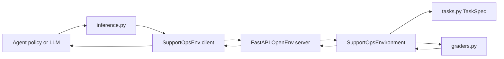
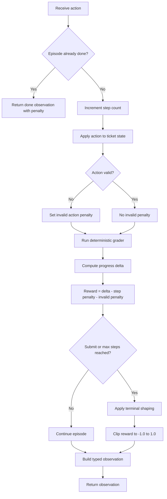
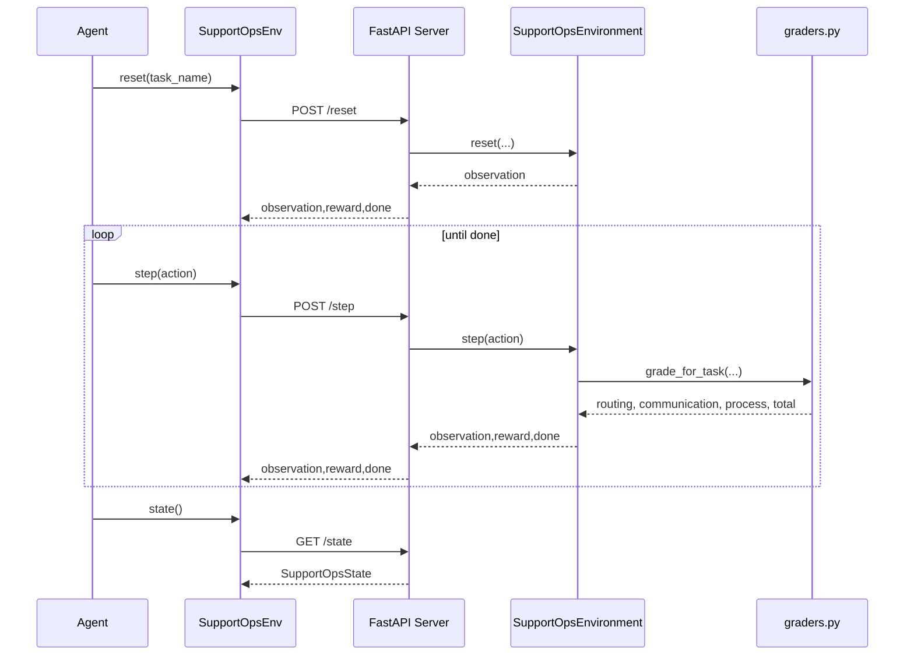
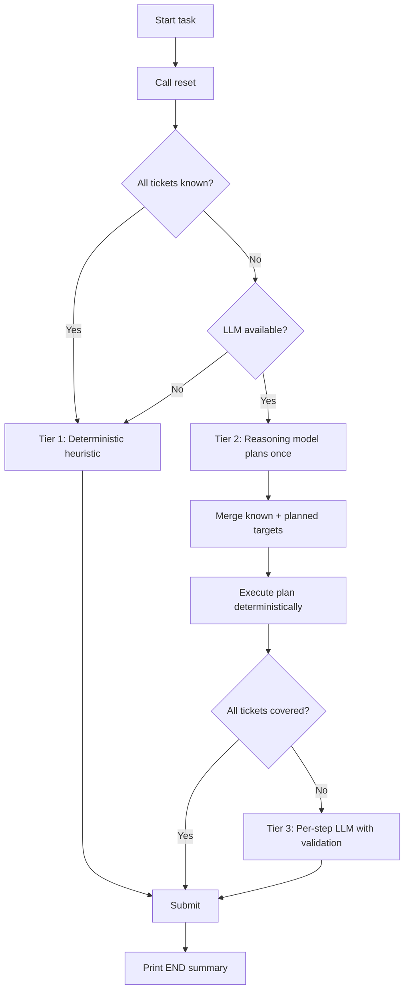
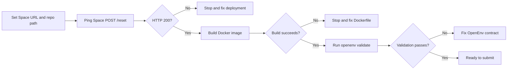

# Proj_Scale Guide

## 1. Overview

Proj_Scale is an OpenEnv-compatible support operations benchmark. It simulates realistic support ticket handling with deterministic scoring so an agent can be evaluated consistently across runs.

The environment tests whether an agent can:

- Prioritize tickets under SLA pressure.
- Classify and route tickets to the correct team.
- Decide when to resolve versus escalate.
- Produce useful customer communication with required content.
- Complete triage efficiently with minimal invalid actions.

This guide is intended for:

- Contributors extending task sets and graders.
- Evaluators integrating models with the environment.
- Operators deploying the benchmark in local or containerized environments.

---

## 2. Repository Structure and Responsibilities

| Path                                | Responsibility                                                                 |
| ----------------------------------- | ------------------------------------------------------------------------------ |
| `models.py`                         | Typed action, observation, reward, and state models used by server and client. |
| `tasks.py`                          | Deterministic task library (easy, medium, hard) and target outcomes.           |
| `graders.py`                        | Deterministic scoring logic for routing, communication, and process quality.   |
| `server/support_ops_environment.py` | Core environment state machine and reward shaping.                             |
| `server/app.py`                     | FastAPI app wiring OpenEnv server plus task introspection endpoints.           |
| `client.py`                         | Typed OpenEnv client used by inference or external agents.                     |
| `inference.py`                      | Baseline runner with heuristic or model-driven action generation.              |
| `openenv.yaml`                      | OpenEnv environment descriptor (entrypoint, runtime, metadata).                |
| `Dockerfile`                        | Container build and runtime configuration.                                     |
| `preval_script.sh`                  | Pre-submission validator for Space ping, Docker build, and openenv validate.   |
| `docs/guide.md`                     | Detailed architecture, workflow, and operations guide.                         |
| `tests/`                            | Pytest suite for API, environment behavior, and grader correctness.            |

---

## 3. Runtime Architecture

### 3.1 High-level data flow



### 3.2 Component interactions

1. The runner chooses a task and calls `reset`.
2. Server instantiates or resets `SupportOpsEnvironment`.
3. Environment seeds ticket state from `TaskSpec`.
4. Agent sends step actions (`set_priority`, `reply`, `submit`, etc.).
5. Environment mutates ticket state, runs deterministic grading, shapes reward, and returns a typed observation.

---

## 4. Data Contracts

### 4.1 Action model (`SupportOpsAction`)

| Field       | Type   | Required    | Notes                                                                                  |
| ----------- | ------ | ----------- | -------------------------------------------------------------------------------------- |
| `command`   | enum   | Yes         | One of `set_priority`, `set_category`, `assign_team`, `set_status`, `reply`, `submit`. |
| `ticket_id` | string | Usually     | Required for all commands except `submit`.                                             |
| `value`     | string | Conditional | Required for classification/routing/status commands.                                   |
| `message`   | string | Conditional | Used only for `reply`.                                                                 |

### 4.2 Observation model (`SupportOpsObservation`)

Important fields for policy logic:

- `task_name`, `difficulty`, `task_description`
- `remaining_steps`
- `score` and `progress`
- `grader_breakdown` (`routing`, `communication`, `process`, `total`)
- `reward_details` (`total`, `progress_delta`, `step_penalty`, `invalid_action_penalty`)
- `tickets[]` with status and triage fields
- `action_hints`
- `last_action_error` and `last_action_summary`

### 4.3 State model (`SupportOpsState`)

Exposed through state endpoint and client parsing:

- `episode_id`
- `step_count`
- `active_task`
- `selected_ticket`
- `score`
- `done`

---

## 5. Task Library and Benchmark Design

The benchmark contains 3 deterministic scenarios:

| Task                     | Difficulty | Intent                                                                                  |
| ------------------------ | ---------- | --------------------------------------------------------------------------------------- |
| `easy_access_recovery`   | easy       | Single ticket with straightforward access recovery workflow.                            |
| `medium_billing_dispute` | medium     | Two billing tickets requiring proper urgency ordering and escalation logic.             |
| `hard_incident_swarm`    | hard       | Outage + security + feature request during surge conditions with strict prioritization. |

Each task defines:

- Ticket seeds (`ticket_id`, `subject`, `customer_tier`, `sla_hours`)
- Ticket goals (`priority`, `category`, `team`, `status`, reply keyword rules)
- Process rules (first-action constraints, must-escalate, must-resolve)
- Action hints
- `max_steps`

This ensures deterministic and reproducible evaluation.

---

## 6. Step Execution Workflow

### 6.1 Internal step pipeline



### 6.2 Action validation rules

- Missing `ticket_id` for non-submit commands is invalid.
- Unknown `ticket_id` is invalid.
- Invalid enum values for `priority`, `category`, `team`, `status` are invalid.
- `reply` requires message length of at least 20 characters.

Invalid actions do not crash the environment; they are reflected via `last_action_error` and penalty shaping.

---

## 7. Scoring and Reward Shaping

### 7.1 Grading dimensions

For each task, scoring combines:

- Routing quality
- Communication quality
- Process compliance

Per-task weighted total:

```text
total = 0.5 * routing + 0.3 * communication + 0.2 * process
```

### 7.2 Communication scoring details

Per ticket communication score:

- Keyword coverage fraction over required phrases.
- Length score capped by minimum target length.
- Combined as `0.8 * coverage + 0.2 * length_score`.

### 7.3 Reward function

Core reward at each step:

```text
reward = progress_delta - STEP_PENALTY - INVALID_ACTION_PENALTY
```

Where:

- `progress_delta = score_t - score_(t-1)`
- `STEP_PENALTY = 0.01`
- `INVALID_ACTION_PENALTY = 0.05` when action is invalid, else 0

Terminal shaping:

- If episode ends due to max steps without submit: `-0.02`.
- If done and `score >= 0.95`: `+0.05`.
- Final reward is clipped to `[-1.0, 1.0]`.

---

## 8. API and Client Workflow

### 8.1 API surface

`server/app.py` exposes:

- Standard OpenEnv server routes generated by `create_app` (including reset/step/state and health-style introspection).
- Custom repository routes:
  - `GET /`
  - `GET /tasks`
  - `GET /tasks/{task_name}`

Root endpoint expected payload:

```json
{
  "status": "ok",
  "name": "Proj_Scale",
  "message": "Proj_Scale OpenEnv API is running"
}
```

### 8.2 End-to-end request sequence



---

## 9. Inference Architecture

`inference.py` uses a three-tier hybrid decision pipeline:

| Tier | Trigger | Strategy | LLM Calls |
| ---- | ------- | -------- | --------- |
| 1 | All ticket IDs in known targets | Deterministic heuristic via `TARGET_FIELDS` | 0 |
| 2 | Unknown tickets + LLM available | `REASONING_MODEL` plans once, then deterministic execution | 1 per task |
| 3 | Plan incomplete or failed | Per-step LLM with grading rubric, action validation, and feedback | ~5-15 per task |

Modes:

- Heuristic mode (`FORCE_HEURISTIC=1` or no API key) — Tier 1 only.
- Model mode (OpenAI-compatible client with `API_BASE_URL`, `MODEL_NAME`, `HF_TOKEN`) — all tiers.

### 9.1 Decision pipeline



Every failure gracefully degrades: Tier 3 → Tier 1, Tier 2 → Tier 3 → Tier 1.

### 9.2 Output protocol

The script prints exactly `[START]`, `[STEP]`, `[END]` per task.

---

## 10. Local Development and Execution

### 10.1 Python environment setup

```bash
python -m venv .venv
source .venv/bin/activate
pip install -U pip
pip install -e .
```

### 10.2 Run server locally

```bash
uvicorn server.app:app --host 0.0.0.0 --port 8000
```

### 10.3 Run baseline in local-server mode

```bash
FORCE_HEURISTIC=1 ENV_BASE_URL=http://127.0.0.1:8000 .venv/bin/python inference.py
```

### 10.4 Run baseline in container mode

If `ENV_BASE_URL` is not set, the client can run against a Docker image via `SupportOpsEnv.from_docker_image`.

### 10.5 Run tests and lint checks

```bash
pytest -q tests
ruff check .
```

---

## 11. Containerization and Deployment Workflow

### 11.1 Build and run locally

```bash
docker build -t proj_scale-env:latest .
docker run --rm -p 8000:8000 proj_scale-env:latest
curl -sS http://127.0.0.1:8000/health
```

### 11.2 Pre-submission validation flow



Run validator script:

```bash
bash preval_script.sh https://<your-space>.hf.space .
```

---

## 12. Extension Guide

### 12.1 Add a new task

1. Add a `TaskSpec` in `tasks.py` with:
   - Ticket seeds
   - Goals for each ticket
   - Process rules
   - Action hints
2. Ensure task name is included in `TASK_LIBRARY` ordering.
3. Confirm difficulty and `max_steps` are realistic.

### 12.2 Add grader support

1. Register a grader function in `graders.py`.
2. Add it to `TASK_GRADERS` mapping.
3. Ensure `grade_for_task` can resolve the new task.
4. Keep score output bounded in `[0.0, 1.0]`.

### 12.3 Keep environment behavior deterministic

- Avoid randomness in grading.
- Keep required keyword checks explicit.
- Preserve stable scoring equations.

---

## 13. Operational Troubleshooting

### 13.1 Common issues

| Symptom                        | Likely cause                                 | Fix                                                                 |
| ------------------------------ | -------------------------------------------- | ------------------------------------------------------------------- |
| Invalid action penalties spike | Wrong enum values or missing `ticket_id`     | Validate action payloads before calling step.                       |
| Low communication score        | Missing required keywords or short replies   | Include task-specific keywords and sufficient detail in reply text. |
| Space reset endpoint fails     | Space not running or wrong URL               | Verify Space status and ping URL.                                   |
| Docker healthcheck fails       | API not binding expected host/port           | Confirm `uvicorn` host `0.0.0.0` and port `8000`.                   |
| Validation fails               | Missing OpenEnv fields or bad app entrypoint | Confirm `openenv.yaml` and `server.app:app`.                        |

### 13.2 Debugging tips

- Inspect `last_action_error` in observations immediately after each step.
- Use `grader_breakdown` to see which scoring dimension is lagging.
- Track `reward_details.progress_delta` to identify whether actions are moving score forward.

---

## 14. Quick Reference

### Required action enums

- Priority: `low`, `medium`, `high`, `critical`
- Category: `access`, `billing`, `outage`, `security`, `feature_request`
- Team: `tier1`, `billing`, `sre`, `security`, `product`
- Status: `new`, `in_progress`, `resolved`, `escalated`

### Core constants in environment

- `STEP_PENALTY = 0.01`
- `INVALID_ACTION_PENALTY = 0.05`
- Timeout completion penalty: `0.02`
- High-score bonus threshold: `score >= 0.95`

---

## 15. Suggested Maintenance Checklist

Before merging substantial benchmark changes:

1. Confirm all tasks still produce deterministic scores for same action traces.
2. Confirm reward is still bounded and shaped (not sparse-only).
3. Run local server and baseline heuristic pass for all tasks.
4. Run `pytest -q tests` and confirm all tests pass.
5. Build Docker image and run health check.
6. Run `openenv validate`.
7. Re-run prevalidation script for deployment readiness.

This checklist helps preserve benchmark reliability across contributors and model evaluations.
